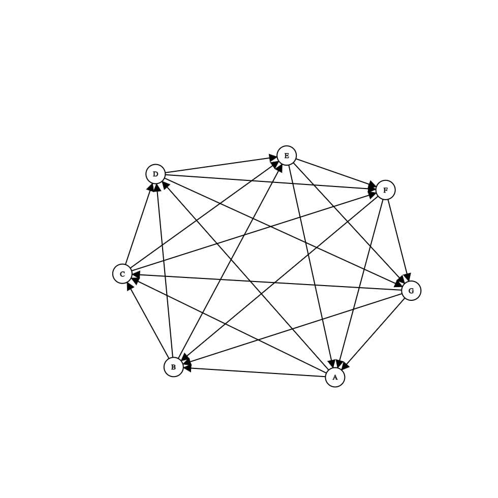

# Task

Using the language of your choice — Java/C#/PHP/JavaScript/TypeScript/Ruby — write a script that implements a generalized rock-paper-scissors game (with the supports of arbitrary odd number of arbitrary combinations).

When launched with command line parameters (arguments to the main or Main method in the case of Java or C#, sys.argv in Python, process.argv in Node.js, etc.) it accepts an odd number >=3 non-repeating strings (if the arguments are incorrect, you must display a neat error message - what exactly is wrong and an example of how to do it right). All messages should be in English. These passed strings are moves (for example, Rock Paper Scissors or Rock Paper Scissors Lizard Spock or 1 2 3 4 5 6 7 8 9).

Important: moves are passed as command line arguments, you don't parse them from the input stream (for example, a move may contain a space, but it shouldn't matter to your code).

The victory is defined as follows - half of the next moves in the circle wins, half of the previous moves in the circle lose (the semantics of the strings-moves is not important, he plays by the rules build upon the moves order the user used, even if the stone loses to scissors in its order - the contents of the strings-moves are not important for you). 

The script generates a cryptographically strong random key (SecureRandom, RandomNumberGenerator, etc. - mandatory!) with a length of at least 256 bits, makes computes move, calculates HMAC (based on SHA2 or SHA3) from the own move with the generated key, displayes the HMAC to the user. After that the user gets "menu" 1 - Stone, 2 - Scissors, ...., 0 - Exit. The user makes his choice (in case of incorrect input, the "menu" is displayed again). The script shows who won, the move of the computer and the original key.

Re-read the paragraph above, the sequence is critical (it simply doesn't make sense to do it differently, for example, showing the key before the user's turn or HMAC instead of the key).

Thus the user can check that the computer plays fair (did not change its move after the user's move).

When you select the "help" option in the terminal, you need to display a table (ASCII-graphic) that determines which move wins.

The table generation should be in a separate class, the definition of the "rules" who won should be in a separate class, the key generation and HMAC functions should be in a separate class (at least 4 classes in total). You should use the core class libraries and third-party libraries to the maximum, and not reinvent the wheel. Help should be formatted as an N + 1 by N + 1 table, where N is the number of moves (determined by the number of arguments passed to the script). +1 to add a title for the rows and a title for the columns (contain the title of the move). Cells can contain Win/Lose/Draw.

THE NUMBER OF MOVES CAN BE ARBITRARY (odd and > 1, depending on the passed parameters), it is not hardwired into the code. 

Example:

```
>java -jar game.jar rock paper scissors lizard Spock
HMAC: 9ED68097B2D5D9A968E85BD7094C75D00F96680DC43CDD6918168A8F50DE8507
Available moves:
1 - rock
2 - paper
3 - scissors
4 - lizard
5 - Spock
0 - exit
? - help
Enter your move: 2
Your move: paper
Computer move: rock
You win!
HMAC key: BD9BE48334BB9C5EC263953DA54727F707E95544739FCE7359C267E734E380A2
```

A common mistake is trying to invent your "HMAC" as a hash of a random "key". This will not work. If you show the same lines before the move and after the move, the user does not receive new information after the move and, accordingly, you do not prove anything to him. It is necessary to generate a key (with a secure generator), make a computer move, calculate HMAC (by a standard algorithm) from a computer move (message) and a key (key), show HMAC, get a user move, show a key. Re-read this paragraph until the total comprehension.

The example of the "correct" order (although the user may use a different order and play a game of scissors defeating rock; or play a game of MOVE1 MOVE2 MOVE3): STONE PAPER SCISSORS or STONE SPOCK PAPER LIZARD SCISSORS.

# Illustration

For the moves A B C D E F G — who is losing to whom. 


